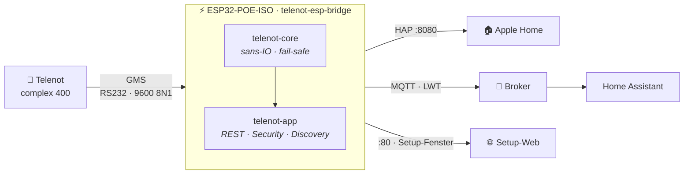

# telenot-esp-bridge

**Telenot complex 400 → HomeKit & Home Assistant. Ein Chip, kein Server.**

[](LICENSE)
[](https://github.com/esp-rs)
[](https://docs.espressif.com/projects/esp-idf/)
[](docs/HARDWARE.md)
[](#status)
[](docs/homeassistant.md)
[](https://github.com/carhensi/telenot-esp-bridge/actions/workflows/ci.yml)
[](https://github.com/carhensi/telenot-esp-bridge/actions/workflows/release.yml)

Robuste **Rust-Firmware-Appliance**, die eine **Telenot complex 400** (Einbruchmeldeanlage)
direkt über deren serielle GMS-Schnittstelle ausliest und steuert — als versiegeltes Gerät
(Olimex **ESP32-POE-ISO-16MB**, PoE-gespeist, galvanisch isoliert) **im EMA-Gehäuse selbst**.
Nachfolger der Node.js-[telenot-bridge](https://github.com/carhensi/telenot-bridge): kein
Host-Rechner, kein Docker, kein externer Serial-TCP-Konverter mehr. Ein Netzwerkkabel rein,
fertig.

> Die Bridge ist **keine Sicherheits-Komponente der EMA** — siehe [Threat-Model](docs/THREAT-MODEL.md).
>
> **Inoffizielles Community-Projekt** — nicht von der Telenot Electronic GmbH entwickelt,
> unterstützt oder autorisiert. „Telenot" und die Produktnamen sind Marken ihrer jeweiligen
> Inhaber und werden hier ausschließlich zur Beschreibung der Kompatibilität verwendet.

## Features

| | Feature | Details |
|---|---|---|
| 🏠 | **HomeKit direkt** | Natives HAP auf dem Chip: SecuritySystem-Kachel + einzelne Melder (Kontakt/Bewegung/Rauch/Wasser) per `show_in_homekit` — ganz ohne Home Assistant |
| 📡 | **MQTT + HA-Discovery** | Retained `state`/Sensoren/`inventory`/`diagnostics` mit LWT-`availability`; Home Assistant legt alle Entities automatisch an |
| 🔐 | **Fail-closed Disarm** | Remote-Unscharf nur bei explizitem Opt-in **und** PIN (Argon2-gehashter Lockout, reboot-fest) — nie optimistisch |
| 🛡️ | **Snapshot = Wahrheit** | Arm-Zustand ausschließlich aus dem zyklischen Blockstatus (0x24); verstummt die Anlage → nach ~9 s `unavailable`, nie veralteter Zustand |
| 🎛️ | **Steuern, nicht nur lesen** | Scharf/unscharf, Meldebereiche sperren (Zone-Bypass), freigegebene Schaltausgänge, Uhr der Zentrale stellen — GMS-konforme Befehls-Transaktion (Sende-Fenster, ACK-Tracking, Retries) |
| 🔌 | **RS232 intern oder TCP** | Onboard-RS232 (UEXT-Modul) oder USR-TCP232 als Fallback — **live umschaltbar, ohne Reboot** |
| ⚡ | **PoE, ein Kabel** | Strom + Netzwerk über Ethernet, galvanisch isoliert — ideal fürs EMA-Gehäuse |
| 🌐 | **Setup-Web** | Preact-Single-Bundle direkt aus der Firmware; Wizard von Login über Melder-Scan bis Commit — nur im Setup-Fenster erreichbar |
| 🧪 | **Host-lauffähig ohne Hardware** | Kompletter Stack (Core, REST, MQTT, Web) läuft via `telenot-sim serve` auf dem Laptop — mit Mock-Anlage, Replay oder echter EMA über TCP |

## Unterstützter Umfang

Die Bridge ist bewusst auf das „GMS-lite-ähnliche" Wohnhaus-Szenario zugeschnitten:
**ein Sicherungsbereich (Bereich 1)** einer Telenot **complex 400**, binäre Melder
(Kontakt/Bewegung/Rauch/Wasser), Monitoring + scharf/unscharf über HomeKit und MQTT.
Dafür ist die GMS-Abdeckung vollständig ([GMS-Coverage](docs/GMS-COVERAGE.md)).

**Nicht unterstützt** (Roadmap, bewusst nicht halb eingebaut):

- Sicherungsbereiche 2–8 (Multi-Bereich) → [GMS-Coverage](docs/GMS-COVERAGE.md)
- Telenot hiplex 8400H → [hiplex-Roadmap](docs/hiplex.md)

## Architektur



```
crates/
  telenot-protocol/  no_std, alloc-frei — FT1.2-Framing + VdS-2465-Sätze + Codec
  telenot-config/    serde-Schema, Validierung (stabile Issue-Codes), Migration + Legacy-Import
  telenot-core/      SANS-IO Kern — Link-Layer, State-Store, Fail-Safe, Command-Reducer, Discovery
  telenot-app/       portable Service-Schicht (std, framework-frei): REST-DTOs + reine Handler,
                     sans-IO Runtime, Security (Session/CSRF, PIN-Verify + Lockout, fail-closed
                     Disarm), Command-Autorisierung, HA-Discovery + Inventory
  telenot-sim/       Host-Daemon `serve`: HTTP/REST + Mock/Replay/TCP-EMA + MQTT — ohne ESP32
  telenot-esp-bridge/  esp-idf I/O-Schale — läuft auf Hardware: UART/TCP-Transport, HTTP(S)-Server,
                     NVS-Secrets, HomeKit (HAP), MQTT-Client, Ethernet
web/                 Setup-Web (Preact, Single-Bundle) — live an die REST-API, MOCK-Offline-Fallback
```

**Trennscharf:** Die sicherheitskritische Logik lebt host-testbar in `telenot-core` (Events +
Zeit → Actions). `telenot-app` ist die transport-agnostische Service-/Vertrag-Schicht (von Host
**und** Firmware geteilt). HTTP/MQTT/HomeKit/Hardware sind austauschbare Schalen drumherum.
MQTT ist die einzige Naht zu Home Assistant — der Core kennt HA nicht.

## Herkunft

Dieses Projekt ist der Neubau der [telenot-bridge](https://github.com/carhensi/telenot-bridge)
(Node.js, >99 % Testabdeckung), die einen Docker-Host und einen USR-TCP232-Konverter brauchte.
Hier läuft dieselbe Aufgabe — mit denselben Garantien, aber als deterministischer sans-IO-Core —
auf einem einzigen Gerät im Anlagengehäuse: ~65 € Material (ESP32-POE-ISO + RS232-Modul +
Gehäuse), dafür robust, bewährt und ohne jede weitere Komponente.

## Ohne Hardware ausprobieren

```bash
# 1) Setup-Web bauen
npm --prefix web install && npm --prefix web run build

# 2) Host-Daemon: serviert Setup-Web + REST gegen den echten Core
cargo run -p telenot-sim -- serve --ema mock --web web/dist/index.html --bind 127.0.0.1:8848
#    → http://127.0.0.1:8848  · Login: telenot-setup
```

`--ema` wählt die EMA-Quelle: `mock` (synthetische Anlage inkl. Discovery), `replay:<bin>`
(Mitschnitt) oder `tcp:<host:port>` (**echte Anlage via USR-TCP232**). Mit
`--mqtt <broker>:1883` publiziert der Daemon live + schickt **HA-Discovery** → Home Assistant
legt die Entities automatisch an. Details: [`web/README.md`](web/README.md).

## Firmware bauen & flashen

### Flashen im Browser (empfohlen)

Fertige Firmware ohne Toolchain: **[Web-Flasher](https://carhensi.github.io/telenot-esp-bridge/)**
(Chrome/Edge/Firefox ≥ 151, Web Serial) — Board per Micro-USB verbinden, klicken, fertig.
Alternativ liegen das merged Image (`.bin` + SHA-256) an jedem
[Release](https://github.com/carhensi/telenot-esp-bridge/releases):

```bash
espflash write-bin 0x0 telenot-esp-bridge-<version>.bin --port <PORT>
```

Zwei Warnungen (Details auf der Flasher-Seite): **nie flashen, solange die RS232 an der
Zentrale hängt** (Masseschleife über den USB-GND), und **„Erase device" löscht auch das
HomeKit-Pairing** — beim Update nicht anhaken.

### Selbst bauen

```bash
# 1) Submodule holen (esp-homekit-sdk, gepinnt) — bei frischem Clone einmalig:
git submodule update --init            # bzw. gleich: git clone --recursive …

# 2) Xtensa-Toolchain (espup) + Env laden:
espup install && . ~/export-esp.sh

# 3) Setup-Web bauen (wird per include_bytes! in die Firmware eingebettet):
npm --prefix web install && npm --prefix web run build

# 4) Bauen + flashen (IMMER mit Custom-Partition-Table: cfg- + HomeKit-Partition!):
cd crates/telenot-esp-bridge && cargo build --release
espflash flash --partition-table partitions.csv --port <PORT> \
  target/xtensa-esp32-espidf/release/telenot-esp-bridge
```

Geflasht wird über den Micro-USB-Port des Boards (CH340). HomeKit-Direktmodus ist Default;
MQTT/Home Assistant unter „Erweitert". Das Setup-Web läuft nur im **Setup-Fenster** (30 min
nach Boot, per Board-Taster BUT1 erneut) — Details in [Hardware](docs/HARDWARE.md).
Das Initialpasswort `telenot-init` ist **per Design öffentlich bekannt**: Login ist nur im
lokalen Setup-Fenster möglich, und die erste Aktion ist der **erzwungene Passwortwechsel** —
vorher lässt die API nichts anderes zu.

## Status

**Die Bridge läuft im Produktivbetrieb** — im EMA-Gehäuse, an der echten Anlage, Updates per OTA.
`cargo test --workspace` (191 Tests) grün, `clippy -D warnings` + `fmt` sauber; CI erzwingt
beides bei jedem Push/PR. Protokoll-Layer vollständig gegen einen realen pcap-Mitschnitt
der Anlage und 198 reale Befehls-Telegramme der Vorgänger-Bridge verifiziert.

| Schicht | Stand |
|---|---|
| `telenot-protocol` / `-config` / `-core` | ✅ host-getestet, pcap-verifiziert |
| `telenot-app` (REST/DTOs/Runtime/Security/HA-Discovery) | ✅ |
| `telenot-sim serve` (Host-Daemon + MQTT) | ✅ |
| Setup-Web (`web/`, Preact) | ✅ live an REST angebunden |
| Firmware auf ESP32-POE-ISO | ✅ läuft — Ethernet, Setup-Web, MQTT, interne RS232 |
| HomeKit-Direktmodus (HAP) | ✅ SecuritySystem + Melder, No-Reboot-Koexistenz (Web :80 / HAP :8080) |
| Umschaltbarer Transport (RS232 ↔ TCP) | ✅ live, ohne Reboot |
| A/B-OTA (SHA-verifiziert) + Bootloader-Rollback | ✅ in Betrieb — Migration, Self-Test und Rollback am Gerät abgenommen (2026-07) |
| Flash-Encryption / Secure Boot (B6) | ⛔ bewusst verworfen — Restrisiko akzeptiert, s. [Threat-Model](docs/THREAT-MODEL.md) |
| Sicherungsbereiche 2–8 (Multi-Bereich) | 🔜 siehe [GMS-Coverage](docs/GMS-COVERAGE.md) |

## Sicherheit, VdS & Versicherung

Klartext für den Einbau ins eigene Haus:

- Die Bridge ist eine **Komfort-/Monitoring-Anbindung** — keine Sicherheits-Komponente der
  EMA. Fällt sie aus, arbeitet die Zentrale unverändert autark weiter.
- Das GMS-Protokoll kennt **keine Authentisierung am Draht**: Wer physischen Zugriff auf die
  RS232-Leitung hat, kann die Anlage unscharf schalten — unabhängig von jeder
  Bridge-Einstellung. Deshalb: Leitung kurz halten und die externe Gerätebox über einen
  **Deckelkontakt in den Sabotagekreis** der Telenot einschleifen
  (siehe [Hardware → Einbau](docs/HARDWARE.md)).
- **Remote-Unscharf ist ab Werk aus** (fail-closed: explizites Opt-in + PIN + Lockout nötig)
  — und sollte in VdS-konformen Installationen auch aus bleiben. Scharf schalten aus der
  Ferne ist unkritisch, unscharf nicht.
- Eine VdS-anerkannte Installation kann durch Fremdanbindungen ihren anerkannten Zustand
  verlieren — das kann den **Versicherungsschutz** berühren. Den Einbau daher mit dem
  **Errichter** absprechen (der kann auch prüfen, ob sich Remote-Unscharf an der
  GMS-Schnittstelle der Zentrale einschränken lässt).
- Die vollständige Analyse inkl. akzeptierter Restrisiken: [Threat-Model](docs/THREAT-MODEL.md).

## Dokumentation

| Dokument | Inhalt |
|---|---|
| [REST-CONTRACT](docs/REST-CONTRACT.md) | HTTP/JSON-API des Setup-Web |
| [MQTT-CONTRACT](docs/MQTT-CONTRACT.md) | Topics, Payloads, HA-Discovery |
| [SECURITY](docs/SECURITY.md) | Schwachstellen melden, Scope, akzeptierte Restrisiken |
| [THREAT-MODEL](docs/THREAT-MODEL.md) | Sicherheitsanalyse + Risiko-Akzeptanz |
| [HARDWARE](docs/HARDWARE.md) | Board, Pinout, RS232-Varianten, Inbetriebnahme |
| [homeassistant](docs/homeassistant.md) | HA-Integrations-Howto |
| [GMS-COVERAGE](docs/GMS-COVERAGE.md) | Protokoll-Abdeckung + Roadmap |
| [DEBUG-CAPTURE](docs/DEBUG-CAPTURE.md) | GMS-Mitschnitt fremder Anlagen (für Tester/Support) |
| [AGENTS](AGENTS.md) | Architektur-Invarianten + Konventionen für Mitwirkende/Agenten |
| [hiplex](docs/hiplex.md) | Roadmap: hiplex 8400H |

Ground Truth sind reale Mitschnitte der laufenden Anlage (pcap plus 198 Befehls-Telegramme
der Vorgänger-Bridge); Framing und Satzformat folgen den publizierten Standards
IEC 60870-5 (FT1.2) und VdS 2465.

## Lizenz

[Apache-2.0](LICENSE)

**Third-Party:** Das Git-Submodule `crates/telenot-esp-bridge/components/esp-homekit-sdk`
ist © Espressif Systems und steht unter der eigenen Lizenz des Upstream-Projekts
(ESPRESSIF MIT License) — es ist **nicht** Teil der Apache-2.0-Lizenz dieses Repos.
Bei frischem Clone: `git submodule update --init --recursive` (siehe Quickstart).
